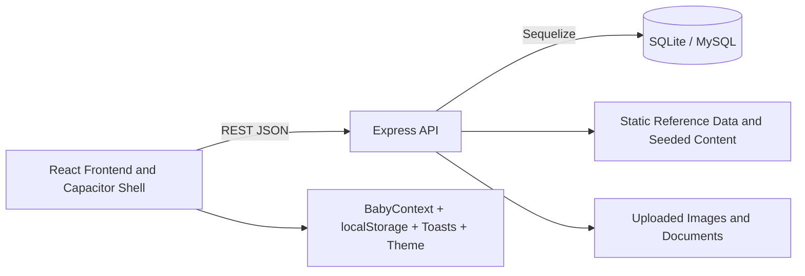

# NutriTrack

NutriTrack is a maternal and child health tracking platform built as a full-stack web and mobile application. The project combines a React and Vite frontend, an Express and Sequelize backend, and a Capacitor Android shell so the same product can be used as a web app or packaged mobile app.

The application is centered on two user journeys:

- pregnant users who need nutrition guidance, pregnancy health support, pregnancy growth tracking, and vaccine information
- new parents who need baby profiles, feeding logs, growth records, documents, reminders, hospital visits, and profile coordination tools

## Project Layout

- Frontend: [FrontEnd/](FrontEnd/)
- Backend: [backend/](backend/)
- Native Android shell: [FrontEnd/android/](FrontEnd/android/)
- Shared project notes: [README.md](README.md)

## What the Project Includes

NutriTrack is not a simple tracker or static content app. It combines authentication, role-based routing, structured health workflows, and reference content in one product.

- Onboarding screens introduce the app with health education slides before sign-in.
- Authentication supports sign-up, login, and current-user restoration through JWT access tokens.
- Role-based routing separates new parent screens from pregnant user screens.
- Baby management allows users to create and manage one or more child profiles.
- Growth tracking stores measurements and progress records.
- Feeding support includes feeding guidance and feeding logs.
- Vaccine support includes vaccine schedules, vaccine guidance, and reminder records.
- Document support allows uploads and review of child health documents.
- Profile support includes emergency contact management, partner invitation flows, image upload, and profile statistics.
- Hospital visit tracking and pregnancy growth tracking are available for pregnancy-focused care.
- Static health content supplies daily tips, nutrition tips, safe foods, feeding guidance, growth milestones, and vaccine schedules.

## Frontend Architecture

The frontend entry point is [FrontEnd/src/main.jsx](FrontEnd/src/main.jsx). It mounts the app inside `StrictMode` and wraps it with a theme provider and toast provider before rendering the main application.

The app shell itself is defined in [FrontEnd/src/App.jsx](FrontEnd/src/App.jsx). It wraps the UI in the `BabyProvider`, handles Capacitor-specific behavior on native platforms, and defines the router.

Native behavior handled by the app shell includes:

- setting the mobile status bar style
- enabling the Android back button to navigate back when possible
- exiting the app when the user is already at the top of the navigation stack

State shared across the frontend is managed through context and local storage:

- `BabyContext` loads the user's babies from the backend
- the currently selected baby is stored in local storage under `selectedBabyId`
- login and logout events refresh or clear baby state
- the app automatically picks an active baby when one exists

The frontend API layer is centralized in [FrontEnd/src/api.js](FrontEnd/src/api.js). It attaches the auth token, handles API errors, and exposes the backend requests used across the UI.

## Frontend Routes

Public routes:

- `/onboarding`
- `/login`
- `/signup`

Protected new parent routes:

- `/home`
- `/add-baby`
- `/nutrition`
- `/vaccines`
- `/feeding`
- `/feeding/history`
- `/growth`
- `/hospital-visits`
- `/documents`
- `/profile`

Protected pregnant user routes:

- `/pregnant/home`
- `/pregnant/health-guide`
- `/pregnant/vaccines`
- `/pregnant/vaccines/health`
- `/pregnant/emergency`
- `/pregnant/growth`

Fallback behavior:

- `/` redirects to `/onboarding`
- all unknown routes also redirect to `/onboarding`

## Frontend Flow

The actual user flow in the codebase is:

1. The user opens the app on the onboarding page.
2. The onboarding experience presents three slides: danger signs awareness, vaccination schedule, and healthy family benefits.
3. The user skips or completes onboarding and moves to login.
4. The user signs up or logs in.
5. After authentication, the app uses protected routes and the active user type to show the correct dashboard and screens.
6. The parent flow focuses on baby care and child health data.
7. The pregnant flow focuses on pregnancy health, nutrition, vaccines, emergency information, and pregnancy growth.

## Backend Architecture

The backend entry point is [backend/src/server.js](backend/src/server.js). It creates the Express application, enables JSON and URL-encoded parsing, applies CORS rules, serves uploaded files, mounts the API routers, syncs Sequelize, runs migrations, and seeds reference data before starting the server.

Backend startup behavior includes:

- database authentication
- migration execution through Umzug
- model synchronization through Sequelize
- vaccine seeding
- feeding seeding
- food seeding
- listening on the configured port and host

The backend is configured from [backend/src/config/index.js](backend/src/config/index.js).

Important runtime settings include:

- `PORT` for the server port
- `DATABASE_URL` for the database connection
- `SECRET_KEY` for JWT signing in production
- `ALGORITHM` for the JWT algorithm
- `ACCESS_TOKEN_EXPIRE_MINUTES` for token lifetime
- CORS support for localhost, local network IPs, file origins, Capacitor origins, and direct mobile traffic

## Backend Routes

All API routes are mounted under `/api`.

Authentication:

- `POST /api/auth/register`
- `POST /api/auth/login`
- `GET /api/auth/me`

Babies and growth:

- `GET /api/babies`
- `POST /api/babies`
- `GET /api/babies/:babyId`
- `PUT /api/babies/:babyId`
- `DELETE /api/babies/:babyId`
- `GET /api/growth/records`
- `POST /api/growth/records`
- `GET /api/growth/records/:recordId`
- `PUT /api/growth/records/:recordId`
- `DELETE /api/growth/records/:recordId`

Reminders and vaccines:

- `GET /api/reminders`
- `POST /api/reminders`
- `PATCH /api/reminders/:reminderId/complete`
- `DELETE /api/reminders/:reminderId`
- `GET /api/vaccines`
- `GET /api/vaccines/mother`
- `GET /api/vaccines/:vaccineId`
- `GET /api/vaccines/reminders/user`
- `POST /api/vaccines/reminders`
- `POST /api/vaccines/reminders/cleanup`
- `PATCH /api/vaccines/reminders/:reminderId/status`
- `DELETE /api/vaccines/reminders/:reminderId`

Reference content and profile:

- `GET /api/static/daily-tip`
- `GET /api/static/nutrition-tips`
- `GET /api/static/safe-foods`
- `GET /api/static/vaccine-schedule`
- `GET /api/static/feeding-guide`
- `GET /api/static/growth-milestones`
- `GET /api/profile`
- `PUT /api/profile`
- `DELETE /api/profile`
- `POST /api/profile/emergency-contact`
- `GET /api/profile/emergency-contact`
- `DELETE /api/profile/emergency-contact/:id`
- `POST /api/profile/partner-invite`
- `GET /api/profile/partner-invitations`
- `PATCH /api/profile/partner-invitations/:invitationId/accept`
- `PATCH /api/profile/partner-invitations/:invitationId/decline`
- `POST /api/profile/image`
- `GET /api/profile/statistics`

Feeding, foods, milestones, documents, and logs:

- `GET /api/feedings`
- `GET /api/feedings/:feedingId`
- `GET /api/foods/all`
- `GET /api/foods/pregnancy`
- `GET /api/foods/type/:type`
- `GET /api/foods/category/:category`
- `GET /api/foods/nutrient-group/:group`
- `GET /api/foods/trimester/:trimester`
- `GET /api/foods/diet-type/:dietType`
- `GET /api/foods/search`
- `GET /api/foods/nutrient-groups`
- `GET /api/milestones/:babyId`
- `POST /api/milestones`
- `PUT /api/milestones/:id`
- `DELETE /api/milestones/:id`
- `POST /api/documents/upload`
- `GET /api/documents/file/:id`
- `GET /api/documents/counts/:babyId`
- `GET /api/documents/:babyId/documents`
- `GET /api/documents/:babyId/:category`
- `DELETE /api/documents/:id`
- `GET /api/feeding-logs/logs`
- `POST /api/feeding-logs/logs`
- `GET /api/feeding-logs/logs/summary`
- `GET /api/feeding-logs/logs/:logId`
- `PUT /api/feeding-logs/logs/:logId`
- `DELETE /api/feeding-logs/logs/:logId`

Pregnancy growth and hospital visits:

- `GET /api/pregnancy-growth/records`
- `POST /api/pregnancy-growth/records`
- `GET /api/pregnancy-growth/records/:recordId`
- `PUT /api/pregnancy-growth/records/:recordId`
- `DELETE /api/pregnancy-growth/records/:recordId`
- `GET /api/hospital-visits`
- `POST /api/hospital-visits`
- `GET /api/hospital-visits/:visitId`
- `PUT /api/hospital-visits/:visitId`
- `DELETE /api/hospital-visits/:visitId`

## Data Model

The model registry in [backend/src/models/index.js](backend/src/models/index.js) includes:

- User
- Baby
- GrowthRecord
- Reminder
- Vaccine
- EmergencyContact
- Partner
- Feeding
- Food
- DevelopmentMilestone
- BabyDocument
- FeedingLog
- PregnancyGrowth
- HospitalVisit
- Note

These models support the app's core relationships and workflows:

- users own babies and health records
- babies accumulate growth records, milestones, documents, feeding logs, reminders, and related care data
- reminders and vaccines support scheduling and follow-up
- partner and emergency contact records support family coordination
- pregnancy growth and hospital visit records support pregnancy-specific monitoring

## Storage and File Handling

- SQLite is the default database in local development.
- MySQL is supported when `DATABASE_URL` uses a MySQL connection string.
- Sequelize manages table definitions, associations, synchronization, and migrations.
- Uploaded profile images and document files are served from the backend uploads directory.
- Document uploads accept PDF, JPG, JPEG, PNG, and image-based assets as defined in the controller and route setup.

## Technology Stack

Frontend:

- React 19
- Vite
- React Router
- Capacitor
- Framer Motion
- Recharts
- Lucide icons
- Tailwind and PostCSS tooling

Backend:

- Node.js
- Express
- Sequelize
- Umzug migrations
- bcryptjs
- jsonwebtoken
- multer
- cors
- Joi and express-validator

Databases and drivers:

- SQLite
- MySQL
- PostgreSQL driver support in the dependency set

## Runtime Scripts

Frontend scripts in [FrontEnd/package.json](FrontEnd/package.json):

- `npm run dev`
- `npm run build`
- `npm run lint`
- `npm run preview`
- `npm run build:mobile`
- `npm run build:apk`
- `npm run open:android`

Backend scripts in [backend/package.json](backend/package.json):

- `npm start`
- `npm run dev`
- `npm run migrate`
- `npm run migrate:undo`
- `npm run migrate:status`

## Architecture Summary

## Summary

NutriTrack is a routed, token-protected health tracking system for pregnant users and parents of young children. It combines onboarding, authentication, baby management, growth tracking, feeding and nutrition guidance, vaccines, reminders, documents, hospital visits, pregnancy growth tracking, profile coordination, and seeded health reference data in one application.
